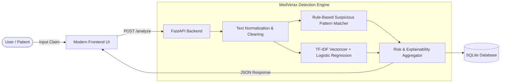

# 🛡️ MedVerax AI – Health Misinformation Detection System

**MedVerax AI** is an explainable health misinformation detection web platform designed to analyze viral medical claims, evaluate their scientific plausibility, flag deceptive patterns, and provide actionable clinical safety recommendations.

---

## 📌 Problem Statement

Medical misinformation circulating across platforms like WhatsApp, YouTube, and Instagram poses serious risks to public health. Unverified claims frequently promote dangerous home remedies, sensational "miracle cures", or encourage patients to abandon evidence-based treatments.

**MedVerax AI** acts as a first-line digital verification assistant that:
1. Preprocesses and normalizes health-related claims.
2. Applies a **TF-IDF + Logistic Regression** machine learning classifier.
3. Evaluates text against a high-precision **rule-based detection engine**.
4. Categorizes claims into **Low, Medium, or High Risk**.
5. Explains *why* a claim was flagged in clear, accessible language.
6. Automatically logs analysis history to a local **SQLite** database.
7. Displays a mandatory medical disclaimer emphasizing consultation with licensed healthcare professionals.

---

## 🏗️ System Architecture



---

## 🛠️ Technology Stack

| Layer | Technology |
|---|---|
| **Frontend** | HTML5, CSS3, JavaScript (Fetch API, Modern Responsive Layout) |
| **Backend** | Python 3.10+, FastAPI, Uvicorn |
| **Machine Learning** | scikit-learn (TF-IDF Vectorizer, Logistic Regression), pandas, joblib |
| **Database** | SQLite3 |
| **Version Control** | Git & GitHub |

---

## 📂 Project Structure

```text
medverax-ai/
│
├── backend/
│   ├── main.py                 # FastAPI application routes & middleware
│   ├── database/
│   │   ├── db.py               # SQLite schema, connection & query handlers
│   │   └── analyses.db         # Local database (auto-generated)
│   ├── model/
│   │   ├── tfidf_vectorizer.joblib
│   │   └── logistic_regression_model.joblib
│   ├── services/
│   │   ├── preprocessor.py     # Text cleaning and normalization
│   │   ├── rules.py            # Rule-based suspicious pattern matcher
│   │   └── explainer.py        # Risk aggregator, explainability & disclaimer
│   └── requirements.txt        # Python backend dependencies
│
├── frontend/
│   ├── index.html              # Responsive healthcare UI dashboard
│   ├── style.css               # Modern healthcare styling & risk themes
│   └── script.js               # API caller, DOM updater & history manager
│
├── data/
│   └── health_claims.csv       # Curated health claims dataset (reliable vs. misinfo)
│
├── notebooks/
│   └── train_model.py          # Machine learning model training script
│
├── .gitignore
├── requirements.txt
└── README.md
```

---

## 🚀 Quickstart Guide (Windows & VS Code)

### 1. Clone or Open the Repository in VS Code
```powershell
cd medverax-ai
```

### 2. Create and Activate Virtual Environment
```powershell
python -m venv venv
.\venv\Scripts\Activate.ps1
```
*(If prompted with PowerShell script permissions, run: `Set-ExecutionPolicy -ExecutionPolicy RemoteSigned -Scope Process`)*

### 3. Install Dependencies
```powershell
pip install -r requirements.txt
```

### 4. (Optional) Train / Retrain the Machine Learning Model
```powershell
python notebooks/train_model.py
```

### 5. Start the FastAPI Server
```powershell
uvicorn backend.main:app --reload --host 127.0.0.1 --port 8000
```

### 6. Open the Application
Open your browser and navigate to:
👉 **[http://127.0.0.1:8000/](http://127.0.0.1:8000/)**

Interactive API documentation is also available at:
👉 **[http://127.0.0.1:8000/docs](http://127.0.0.1:8000/docs)**

---

## 📡 API Endpoints

### `GET /health`
Verifies backend status and model loading.
```json
{
  "status": "healthy",
  "service": "MedVerax AI",
  "model_loaded": true,
  "version": "1.0.0"
}
```

### `POST /analyze`
Analyzes a health claim.

**Request:**
```json
{
  "text": "This herbal tea guarantees a 100% cure for cancer in 2 weeks with no doctor needed."
}
```

**Response:**
```json
{
  "claim": "This herbal tea guarantees a 100% cure for cancer in 2 weeks with no doctor needed.",
  "risk_level": "High Risk",
  "prediction": "Potential misinformation",
  "confidence": 0.95,
  "ml_misinfo_probability": 0.92,
  "detected_patterns": [
    {
      "category": "Absolute Cure Claim",
      "severity": "high",
      "matched_phrases": ["100% cure"],
      "explanation": "Absolute cure claims are a major indicator of medical misinformation."
    },
    {
      "category": "Dangerous Medical Avoidance",
      "severity": "high",
      "matched_phrases": ["no doctor needed"],
      "explanation": "Advising patients to discontinue prescribed medications poses severe health risks."
    }
  ],
  "explanation": "Contains absolute cure claim phrases (\"100% cure\"). Contains dangerous medical avoidance phrases (\"no doctor needed\").",
  "safety_recommendation": "Caution: This claim exhibits high-risk indicators. Never discontinue prescribed therapies without consulting a licensed physician.",
  "disclaimer": "This system is for information and awareness only. It does not provide medical diagnosis or replace a qualified healthcare professional."
}
```

### `GET /history`
Retrieves past query history from SQLite.

### `DELETE /history`
Clears past query history.

---

## 🐙 Linking to GitHub

To push your project to GitHub:

1. **Initialize Git repository**:
   ```powershell
   git init
   ```
2. **Stage and commit files**:
   ```powershell
   git add .
   git commit -m "feat: initial release of MedVerax AI health misinformation detection system"
   ```
3. **Create a new empty repository on [GitHub](https://github.com/new)** (e.g. `medverax-ai`).
4. **Link and push**:
   ```powershell
   git branch -M main
   git remote add origin https://github.com/YOUR_USERNAME/medverax-ai.git
   git push -u origin main
   ```

---

## ⚖️ Ethical Medical Disclaimer

> **Important Safety Notice**: MedVerax AI is built for informational and educational awareness purposes only. It is not an automated medical diagnostic tool and does not substitute professional medical advice, diagnosis, or treatment. Users should always consult qualified healthcare professionals regarding any medical condition or before altering prescribed treatments.
